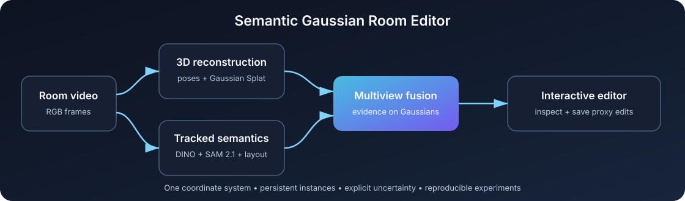

# Semantic Gaussian Room Editor

An end-to-end research prototype for reconstructing an indoor scene as one coherent 3D
Gaussian Splat, tracking objects across video frames, attaching multiview semantic evidence,
and inspecting the resulting scene in a browser editor.



**[Launch the live interactive demo](https://aaravofc.github.io/semantic-gaussian-room-editor/)**

The hosted demo opens directly in a browser and uses a privacy-safe synthetic room. No install,
GPU, account, or uploaded room capture is required.

The central design choice is to keep appearance, geometry, and semantic evidence in one room
coordinate system. Object masks and labels annotate the existing Gaussians instead of replacing
the successful room reconstruction with independently normalized meshes.

## What is implemented

- Monolithic room reconstruction and Gaussian Splat export through Nerfstudio.
- Hierarchical open-vocabulary detection with Grounding DINO.
- Persistent instance propagation with SAM 2.1.
- Separate wall, floor, and ceiling segmentation.
- Footprint-aware multiview semantic evidence on Gaussian centers.
- A custom Splatfacto variant with foreground/background alpha losses, silhouette-gated
  densification, visual-hull support, and ellipsoid containment.
- A Three.js viewer for semantic filtering, object-proxy transforms, removal/restoration, and
  non-destructive edit-state persistence.
- Contract tests covering segmentation logic, notebook integrity, recovery behavior, and the
  custom training method.

## Try the privacy-safe demo

The repository contains a small **synthetic** Gaussian room. It does not contain a real room
capture, private images, or model checkpoints.

Requirements: Node.js 18+ and an internet connection for the viewer's pinned Three.js modules.

For the fastest preview, use the
[hosted GitHub Pages demo](https://aaravofc.github.io/semantic-gaussian-room-editor/). Edits made
there are saved only in the visitor's browser. To run the same viewer with file-backed edit-state
persistence, use the local server:

```bash
node viewer/server.js \
  --data-root "$PWD/demo/scan_demo" \
  --scan scan_demo \
  --output "$PWD/demo/scan_demo/scene_edit_state.json"
```

Open <http://127.0.0.1:5177/viewer/>. Select an object, switch among move/rotate/scale, filter
by label, or save a proxy edit. Regenerate the deterministic demo at any time:

```bash
python scripts/generate_synthetic_demo.py
```

See [the demo recording guide](docs/DEMO.md) for a suggested portfolio clip.

## Pipeline

```text
room video
├── camera registration + one full-room Gaussian Splat
└── anchor detections + persistent masks + structural layout
                         │
                         ▼
             multiview semantic evidence
                         │
                         ▼
          semantic Gaussian scene + proxy editor
```

The primary notebooks are designed for Google Colab:

1. `reconstruction.ipynb` registers frames, trains the full-room scene, and exports `splat.ply`.
2. `segmentation.ipynb` detects persistent instances, propagates masks, predicts structural
   masks, and runs the audit stage.
3. `pipeline.ipynb` projects Gaussian centers and footprints into accepted masks and exports
   semantic metadata and viewer proxies.
4. `object_splat_batch_pipeline.ipynb` runs the object-constrained Gaussian experiment across
   qualifying volumetric instances.

The maintained Python implementations live in `pipelines/`. Notebook-update and recovery
utilities live in `scripts/`.

## Development checks

The contract suite intentionally runs without downloading GPU dependencies:

```bash
python -m unittest discover -s tests -v
node --check viewer/server.js
node --check viewer/main.js
```

The heavier environments are separated by task:

```bash
pip install -r requirements-segmentation.txt
pip install -r requirements-object-splat.txt
```

Install a CUDA-compatible PyTorch build first. The tested object-splat stack uses Python 3.11
or 3.12, NumPy 1.26.4, Nerfstudio 1.1.5, and a GPU. The segmentation notebook installs Meta's
official SAM 2 repository and its checkpoint explicitly.

For direct execution of the tracked segmentation module, copy
`configs/segmentation.example.json`, replace its absolute paths, then run stages in order:

```bash
python -m pipelines.tracked_segmentation --config configs/segmentation.json --stage validate
python -m pipelines.tracked_segmentation --config configs/segmentation.json --stage all
```

## Repository map

```text
pipelines/     maintained segmentation and custom Gaussian-training code
viewer/        dependency-light Node server and Three.js editor
tests/         fast behavioral and notebook-contract tests
scripts/       notebook builders, migration patches, and demo generation
demo/          synthetic publishable viewer data
docs/          architecture, roadmap, and demo guide
research/      hypotheses, evaluation protocol, and empty result registry
*.ipynb        self-contained Colab workflows
```

## Current limitations

This is a research prototype, not a production room editor.

- Object transforms currently change semantic proxy metadata; they do not transform the
  underlying member Gaussians.
- The checked-in experiment registry is intentionally empty. The repository does not claim a
  quantitative improvement over prior methods.
- Full training requires a CUDA GPU and large external checkpoints.
- Results currently represent a single-room development workflow; broader generalization has
  not been established.
- Gaussian-level instance membership, true object transforms, background completion, and
  calibrated evaluation remain active research milestones.

See [the Gaussian-native architecture](docs/GAUSSIAN_SEMANTIC_ARCHITECTURE.md),
[product roadmap](docs/PRODUCT_ROADMAP.md), and [research plan](research/RESEARCH_PLAN.md).

## Data and privacy

Real captures, scans, checkpoints, and generated training outputs are excluded by `.gitignore`.
Before publishing any replacement demo, verify that you own the capture and are comfortable
disclosing both its appearance and spatial layout. Store large authorized assets in a GitHub
Release or an external object store rather than normal Git history.

## Responsible project description

A concise, accurate resume bullet and application paragraph are available in
[PROJECT_SUMMARY.md](PROJECT_SUMMARY.md). Until controlled evaluation is complete, describe the
system as an implemented prototype rather than claiming accuracy improvements or production
object editing.

## Acknowledgements

This project builds on Nerfstudio/Splatfacto, Grounding DINO, Meta SAM 2.1, SegFormer, Three.js,
and `@mkkellogg/gaussian-splats-3d`. Those projects retain their own licenses and model terms.

## License

Original code in this repository is released under the [MIT License](LICENSE). External models,
checkpoints, datasets, and dependencies are governed by their respective licenses.
